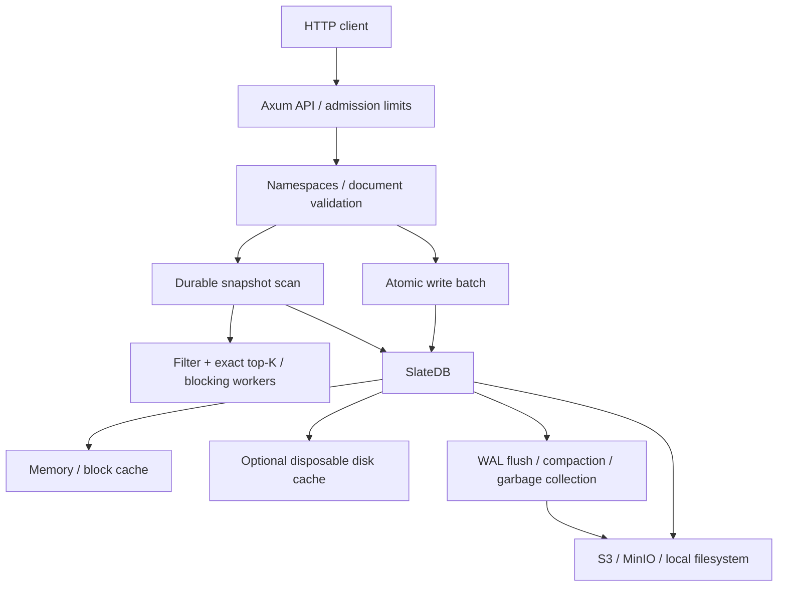

# Architecture

Gengis Mimi owns document semantics and search. SlateDB owns durable key-value storage. The implementation uses SlateDB 0.16.0, pinned in Cargo.toml; Cargo.lock pins transitive dependencies.

## Storage model

One process opens one SlateDB database at the configured storage prefix. All namespaces live in that database, separated by key prefixes. This keeps startup and background-task overhead small. Namespaces are logical isolation boundaries, not independent performance or authorization boundaries.

| Logical key | Value |
| --- | --- |
| `meta/format` | `gengis-mimi:1` format marker |
| `n/<namespace>` | JSON namespace name, dimensions, metric |
| `d/<namespace>/<id>` | JSON document, vector, attributes |

These are **keys inside SlateDB**, not individual S3 object names. SlateDB chooses the physical WAL, manifest, and SST layout. Do not modify those objects directly. An unexpected format marker, or an existing nonempty keyspace without our marker, stops application startup.

JSON keeps this first format inspectable and easy to evolve. Vectors are validated and held as `f32` values; scoring uses `f64` accumulation. A compact binary vector-block format is future work. There is no stable on-disk migration promise yet.

IDs are restricted to ASCII letters, digits, `_`, and `-`, so separators cannot leak documents into another namespace. Namespace dimensions and distance metric are immutable. A document without a vector is valid even in a vector-enabled namespace, but is omitted from vector results.

## Write and recovery contract

1. Validate the namespace, every document, vector, ID, and the full batch size.
2. Reject duplicate IDs, including an ID present in both upsert and delete.
3. Submit one SlateDB `WriteBatch`.
4. Await the returned write handle's `await_durable()`.
5. Return counts and the database-wide sequence number.

The success response means the batch reached the configured durable backend. A sequence number is an ordering token, not a timestamp, idempotency key, or count of documents. All mutations in the batch become visible atomically. There are no cross-namespace batch endpoints.

A timeout, disconnect, or storage error leaves the result potentially unknown: the write can still commit. Replaying an identical upsert/delete batch has the same logical effect when no competing writes intervene. Replaying an older upsert can overwrite a newer document. There is no exactly-once request ledger or conditional update API.

Namespace creation uses a serialized check-and-create task that continues after request cancellation. Repeating the same configuration succeeds; conflicting configurations fail. This prevents a cancelled request from releasing creation ordering halfway through a commit.

SlateDB supplies recovery, WAL ordering, writer fencing, compaction, and reclamation for its own files. Gengis Mimi does not maintain a second WAL. On restart SlateDB reconstructs its state from object storage. Application initialization completes before the listener serves requests.

## Read and search contract

All reads explicitly request SlateDB's `DurabilityLevel::Remote`, including in local mode. This excludes writes that exist only in memory. HTTP reads and writes use the same writer database handle; there are no asynchronously refreshed read replicas.

Each query obtains a SlateDB snapshot and constructs one durable scan. Its version bound is fixed when that iterator is built. The scan resolves overwrites and tombstones, so deleted vectors and old document versions never participate in ranking. A query started after a successful write sees that write, unless superseded by a later write. Concurrent writes may or may not be included, but batches are never partly included.

The query scans every current document in the namespace. It applies metadata filters, scores eligible vectors, and retains only the best K hits in a bounded heap. Ties use ascending ID order. Document decoding and scoring run on Tokio's blocking pool in batches of at most 128 rows or approximately 1 MiB. A single row can take a batch slightly over that byte target.

The query semaphore bounds concurrent searches. A cancelled query can finish its current blocking batch; that batch retains the permit until it exits. Subsequent work is cancelled. Scan pages have their own snapshots; pagination across separate HTTP requests is not a frozen export.

There is no asynchronous **search index** yet. SlateDB's asynchronous flush and compaction are storage operations. Exact search reads current documents directly, so immediate searchability does not require a separate index-plus-pending-writes merge in this version.

## Local and remote backends

For S3/MinIO, the bucket is durable storage and the disk cache is disposable. The client uses path-style requests and conditional PUTs. Only one application writer should run against a prefix; opening another SlateDB writer fences the previous one rather than creating a serving replica.

Local mode enables file and directory `fsync` through `object_store::local::LocalFileSystem`. It also holds an exclusive OS file lock for the data directory. The file may remain after a crash; the OS releases its lock. Do not remove or replace the lock file to bypass ownership.

The local backend does not implement conditional overwrites. Gengis Mimi therefore disables manifest and compactor-metadata deletion in local mode, retaining those small files. WAL/SST cleanup and compaction remain enabled. S3 mode keeps SlateDB's normal metadata GC boundaries. Filesystem durability still depends on the operating system, filesystem, and device; it is not replicated object storage.

## References

- [SlateDB storage design](https://slatedb.io/docs/design/overview/)
- [SlateDB write durability](https://slatedb.io/docs/design/writes/)
- [SlateDB snapshots](https://slatedb.io/docs/design/consistency/)
- [SlateDB garbage collection](https://slatedb.io/docs/design/gc/)

These describe the dependencies and inspiration. This document describes Gengis Mimi's actual implementation and its narrower guarantees.
